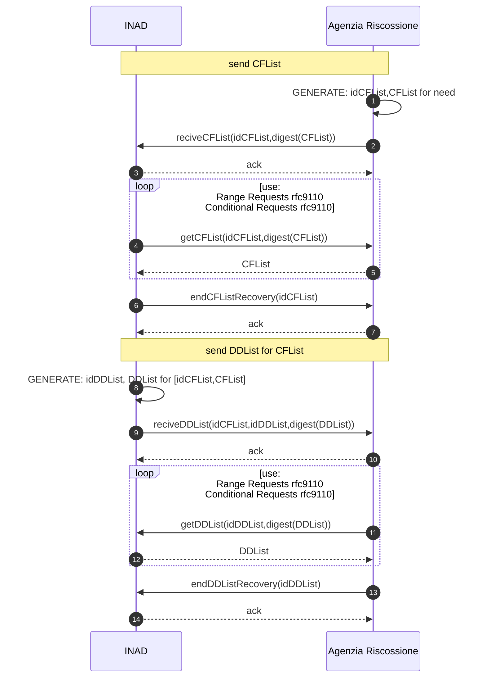

```mermaid

sequenceDiagram
    autonumber

    participant I as INAD
    participant A as Agenzia Riscossione   

    Note over I,A: send CFList
    
    A ->>  A: GENERATE: idCFList,CFList for need
    
    A ->>  I: reciveCFList(idCFList,digest(CFList))
    I -->> A: ack

    loop  use: <br> Range Requests rfc9110 <br> Conditional Requests rfc9110
        I ->>  A: getCFList(idCFList,digest(CFList))
        A -->> I: CFList
    end

    I ->>  A: endCFListRecovery(idCFList)
    A -->> I: ack
    
    Note over I,A: send DDList for CFList
    I ->>  I: GENERATE: idDDList, DDList for [idCFList,CFList]

    I ->>  A: reciveDDList(idCFList,idDDList,digest(DDList))
    A -->> I: ack

    loop  use: <br> Range Requests rfc9110 <br> Conditional Requests rfc9110
        A ->>  I: getDDList(idDDList,digest(DDList))
        I -->> A: DDList
    end

    A ->>  I: endDDListRecovery(idDDList)
    I -->> A: ack

```
